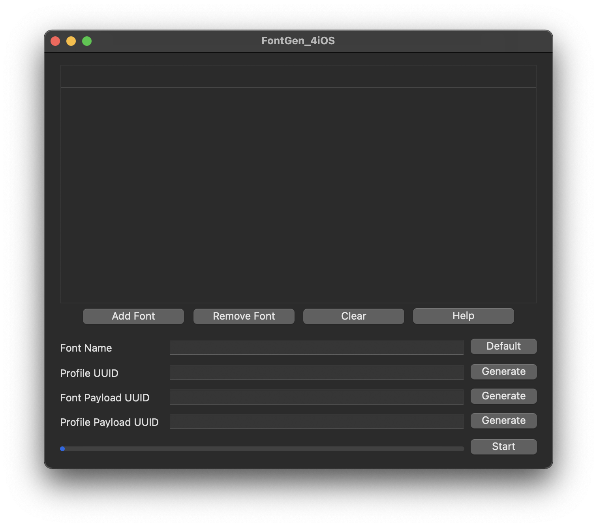
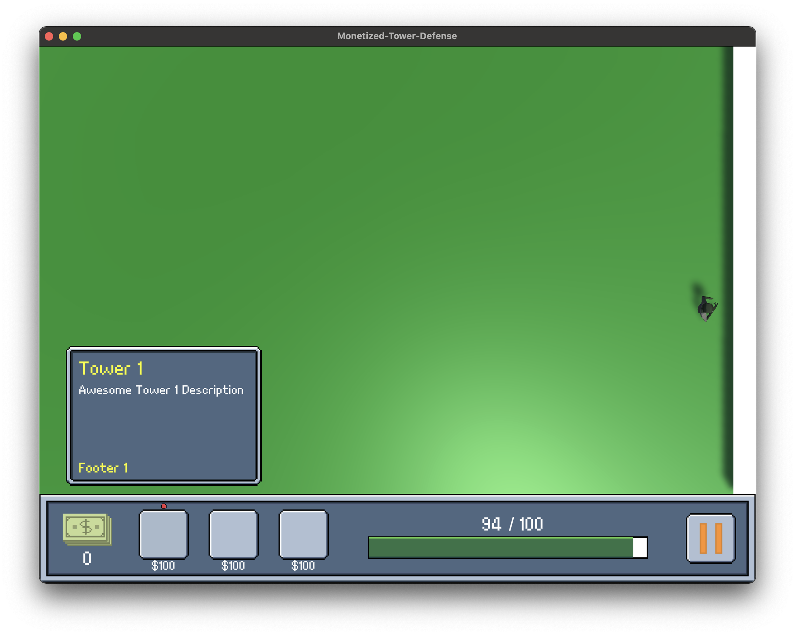
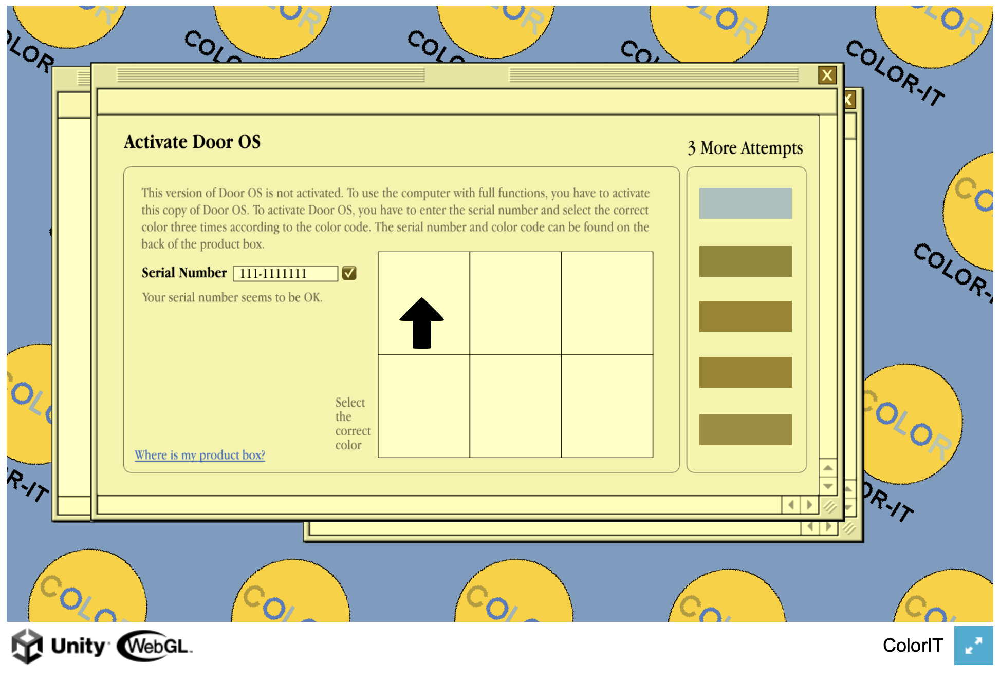
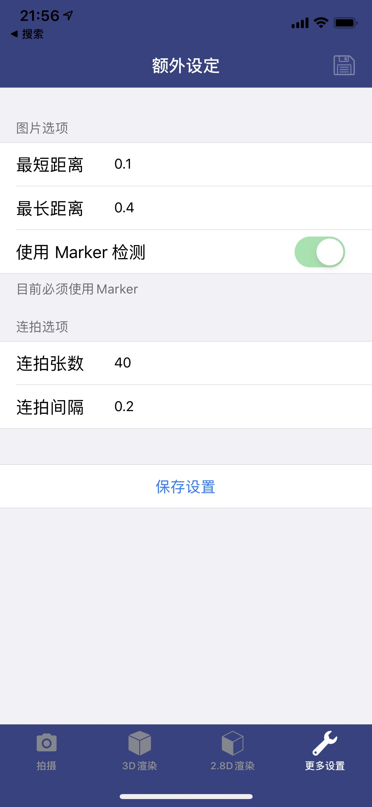

## About Me
<table border="0">
  <tr>
    <td width="100%">
      <h1>ZHENYU CUI</h1>
      
<b>Master in Game Design & Development, Rochester Institute of Technology</b>

      
<b>Estimated Graduation Date: May. 2023</b>

            
<b>zc4702@@rit.edu</b>

       
      
<b>Bachelor of engineering in Computer Science, ShanghaiTech University, 2018</b>

      
<b></b>

       
      
<b>380 John St., NY, 14623</b>

      
<b></b>

    </td>
<!--    <td width="25%">
            I look so awesome!
    </td>-->
  </tr>
</table>

## About the Portfolios

- [**macOS Software Engineering**] [A *.mobileconfig Generator](https://github.com/TomJinW/FontGen_4iOS_Mac)

- [**UI/UX**] [Portfolio: A Tower Defense Game](https://github.com/TomJinW/ATowerDefenseGame)

- [**Game Design, UI/UX, Programming**] [Color-IT: A game which focused on simulating the experience of people with color-blindness.](https://tomjinw.github.io/UnityPlayroom/)

- [**iOS Software Engineering**] [Portfolio: An iOS App using Swift, Objective-C and C++, Introduction](https://github.com/TomJinW/PortfolioNo1)

 

- [**Programming & Game Design**] [Portfolio: A Simple Game using C++, Kinect SDK and Direct2D](https://github.com/TomJinW/PortfolioNo2)

	
- [**Game Design**] [Portfolio: A Game Made with Teammates Using GameMaker Studio](https://github.com/TomJinW/PortfolioNo3)

	
    
