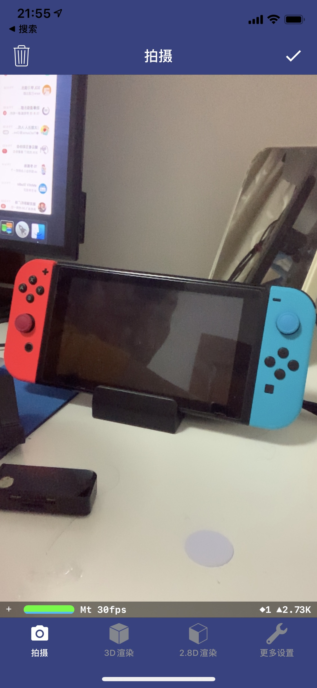
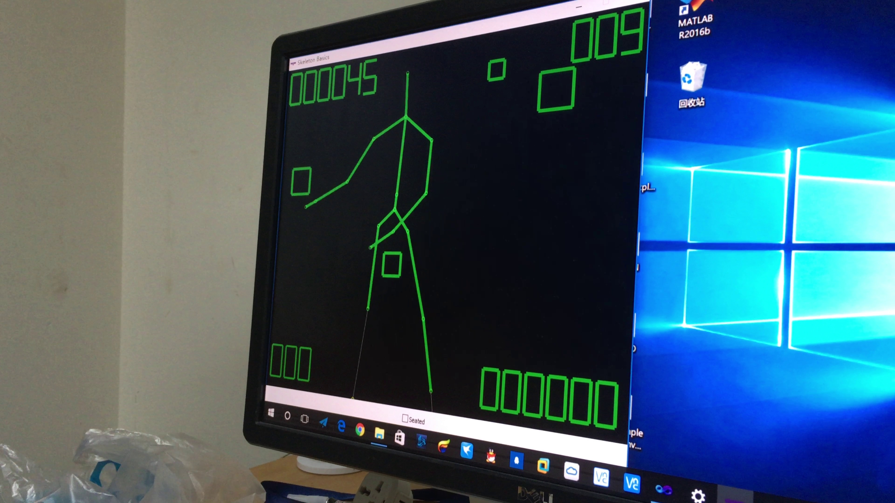
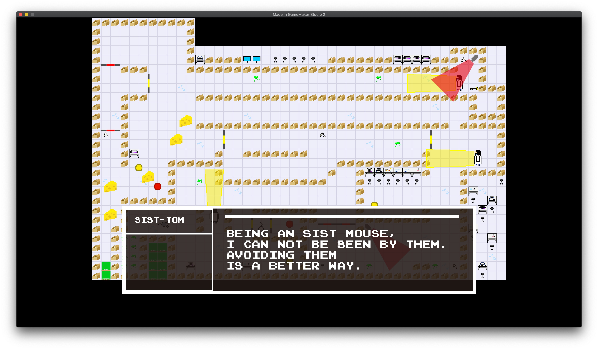

## About Me
<table border="0">
  <tr>
    <td width="75%">
      <h1>CUI ZHENYU</h1>
      
<b>Bachelor of engineering in Computer Science</b>

      
<b>ShanghaiTech University</b>

      
<b>jw95@@live.cn</b>

      
<b>Middle Huaxia Rd. No. 393, Shanghai, China</b>

      
<b></b>

    </td>
    <td width="25%">
            I look so awesome!
    </td>
  </tr>
</table>

## About the Portfolios

I currently have three of them to hand in, each of them has its own project website.

- [Portfoilo No.1:An iOS App using Swift, Objective-C and C++](https://www.dropbox.com/s/hfv8mkxu996wwe9/Portfolio.1.CUI_ZHENYU.zip?dl=0)

	

- [Portfoilo No.2: A Simple Game using C++, Kinect SDK and Direct2D](https://github.com/TomJinW/PortfolioNo2)

	

- [Portfoilo No.3: A Game Made with Teammates Using GameMaker Studio](https://github.com/TomJinW/PortfolioNo3)

	